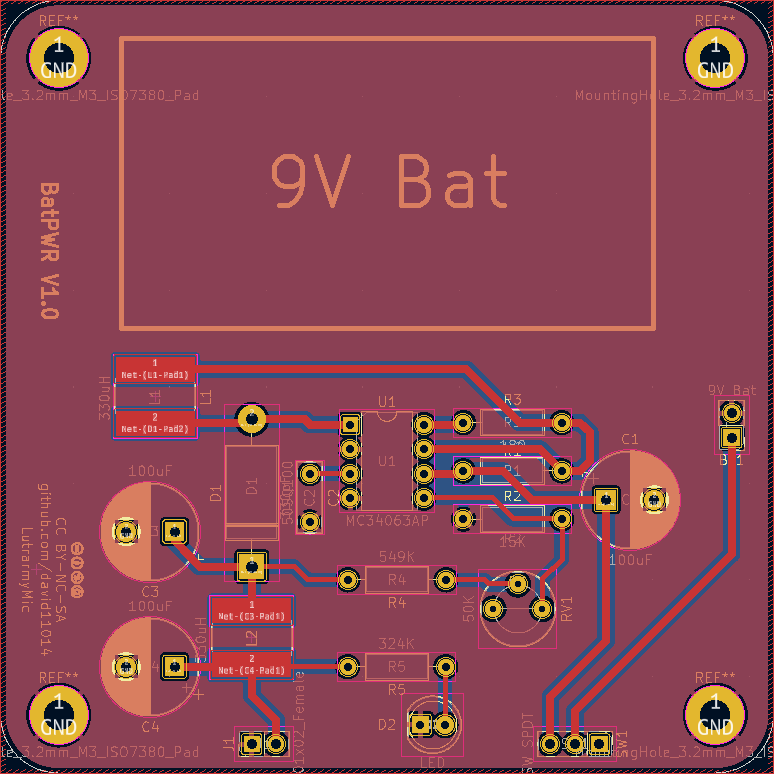
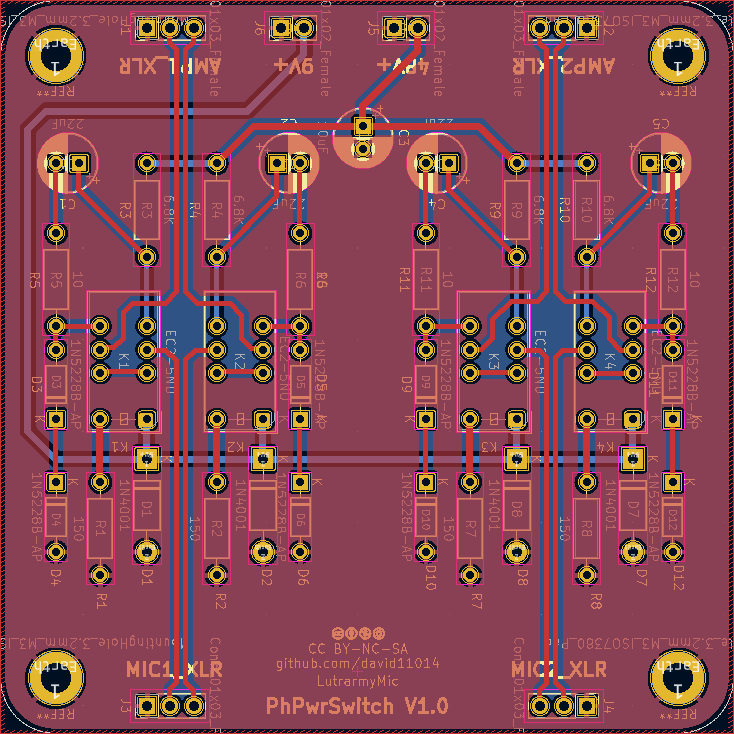
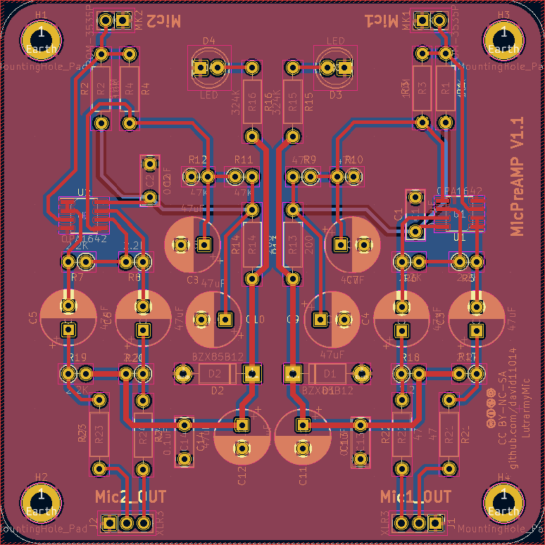

# LutrarmyMic microphone circuit

## Introduction

* The stereo microphone circuit, which support 9V battery and 48V phantom power source.
* This circuit has three module:
	1. Battery power module
		* Convert 9V battery voltage to 48V.
	2. Phantom power switch module
		* Switch the power source between phantom power and battery 48V power.
		* If 9V pin has power, it will convert battery 48V power to phantom power source, or use the power from external phantom power.
	3. Microphone pre-amplifier module
		* The pre-amplifier of microphone, use the phantom power.

## Battery power module

## Phantom power switch module

## Microphone pre-amplifier module
