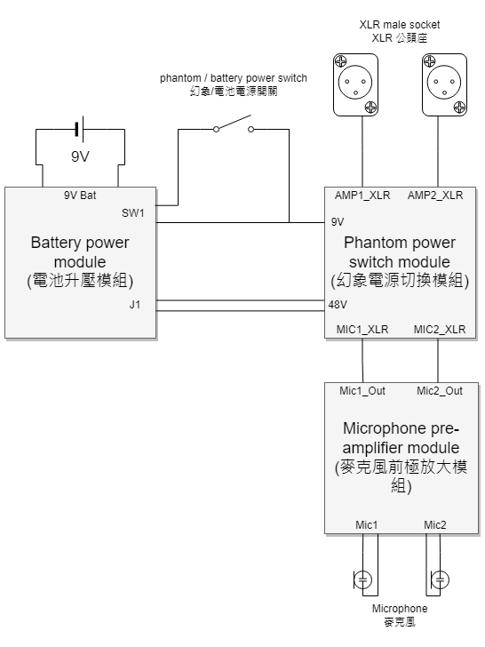
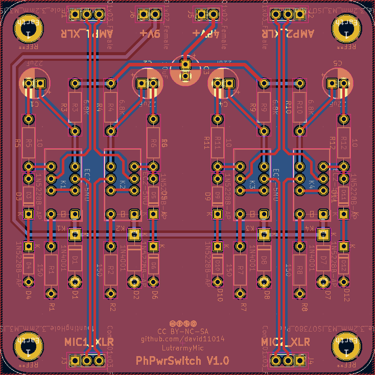
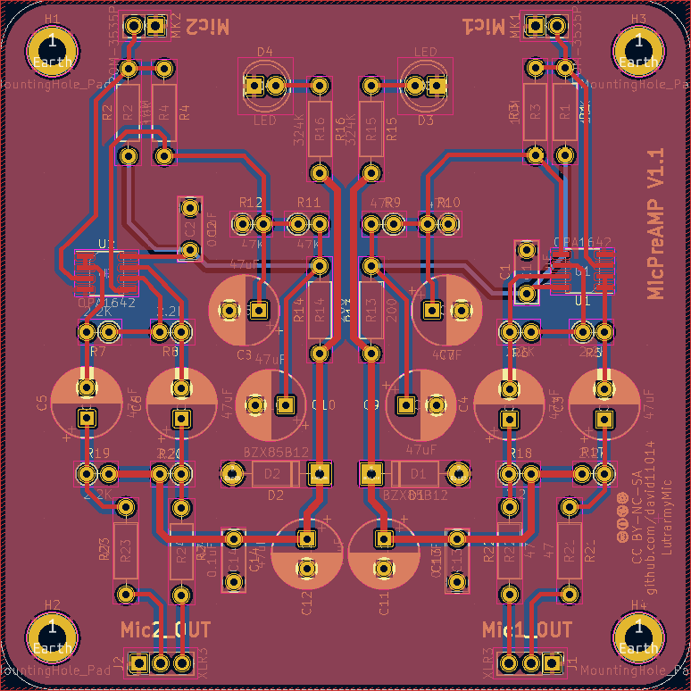

# LutrarmyMic microphone circuit

## 簡介

* 支援 9V 電池電源與 48V 幻象電源的立體聲麥克風電路。
* 此電路由以下模組組成:
	1. 電池升壓模組
		* 轉換 9V 電壓為 48V
	2. 幻象電源切換模組
		* 切換幻象電源與電池的 48V 電源
		* 當 9V 接口有電壓時，使用電池的 48V 電源並轉成前極放大模組所需的幻象電源，否則使用外部的幻象電源
	3. 麥克風前極放大模組
		* 使用幻象電源的麥克風前極放大模組

## Battery power module

## Phantom power switch module

## Microphone pre-amplifier module
